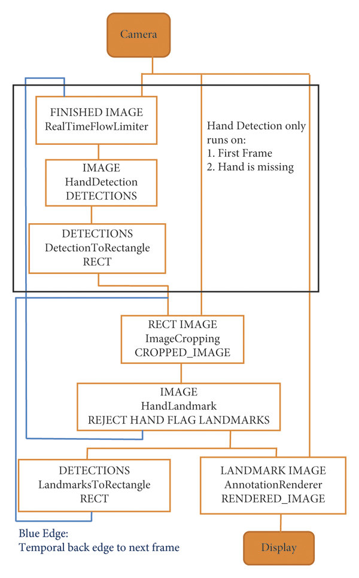

# MediaPipe
MediaPipe is an open-source framework developed by Google that offers a wide range of pre-trained machine learning models and pipelines for various tasks related to computer vision and machine learning. It provides a flexible architecture for building scalable and efficient pipelines for processing multimedia data, such as images, videos, and audio.
### MediaPipe Face detection
MediaPipe's face detection model is based on machine learning techniques and has been trained on large datasets to accurately detect faces under various conditions, including different poses, lighting conditions, and occlusions. It leverages state-of-the-art deep learning architectures to achieve high accuracy while maintaining real-time performance, making it suitable for applications where fast and reliable face detection is essential.

Face detection with MediaPipe is a popular use case because of its accuracy, efficiency, and ease of integration. By using MediaPipe's pre-trained face detection model, developers can quickly and accurately detect faces in images or video streams, which is a fundamental task in many applications such as facial recognition, emotion detection, and augmented reality.

### MediaPipe Hand Detection

  

**Landmarks**

  

#### Poae Detection Landmarks

  

